# ***V***isual and ***I***nfrared fu***S***ion quali***T***y ***A***ssessment Dataset (VISTA) 

<!--中/英 文档切换-->

[[简体中文]](README_CN.md) 👈 | [English]

README_CN.md)

## Introduce

Detailed dataset information will be released in the future.

## Demo

The following image is a demo of VISTA dataset. The detailed dataset will be released in the future.

|           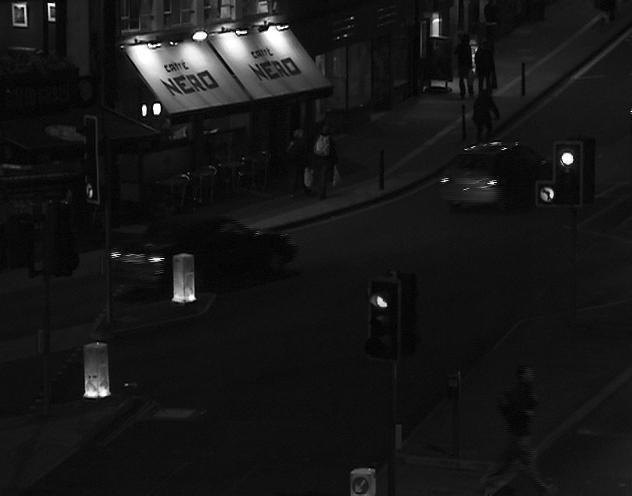            |           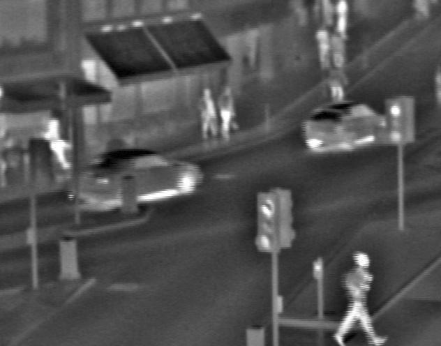            |           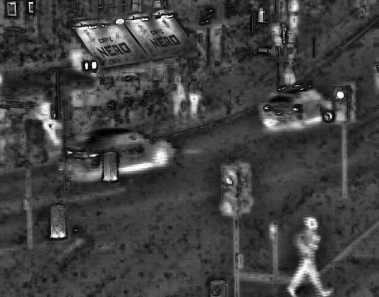            |           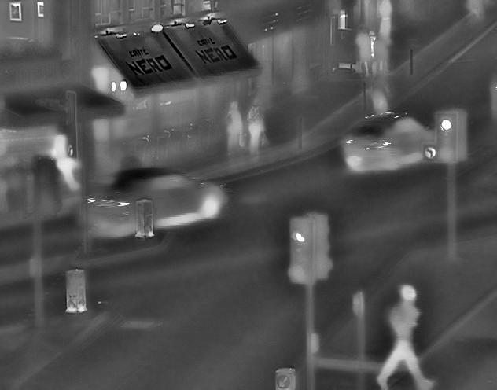            |           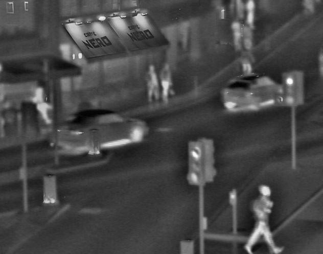            |           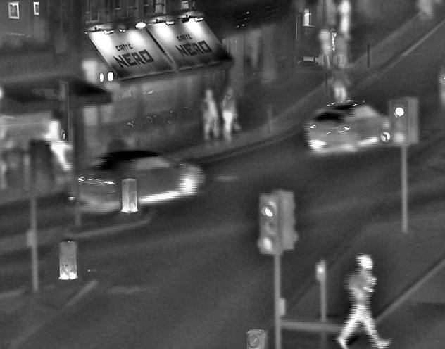            |           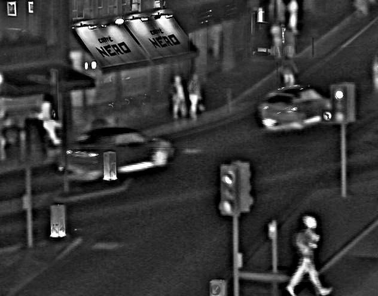            |
| :--------------------------------------: | :--------------------------------------: | :--------------------------------------: | :--------------------------------------: | :-------------------------------------------: | :--------------------------------------: | :-------------------------------------------: |
|                 Visible                  |                 Infrared                 |                  0.0598                  |                  0.3330                  |                    0.4149                     |                  0.6468                  |                    0.7732                     |
|      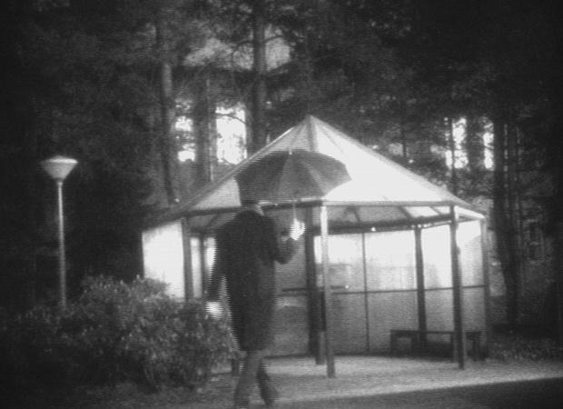      |            |      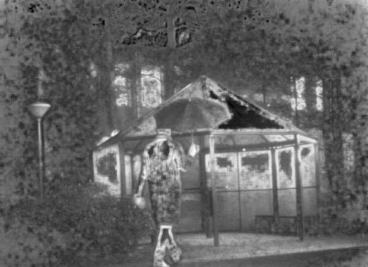      |      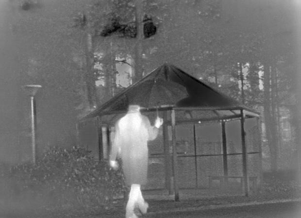      |      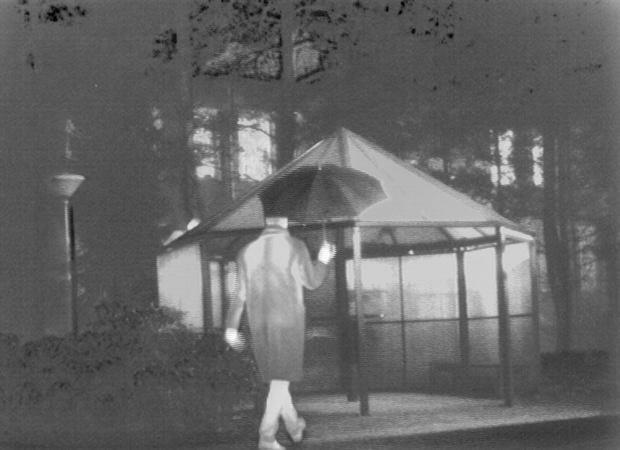      |      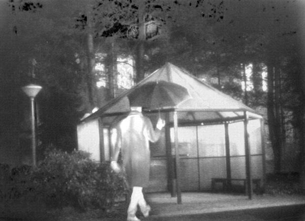      |            |
|                 Visible                  |                 Infrared                 |                  0.0825                  |                  0.3733                  |                    0.5565                     |                  0.8145                  |                    0.7225                     |
| 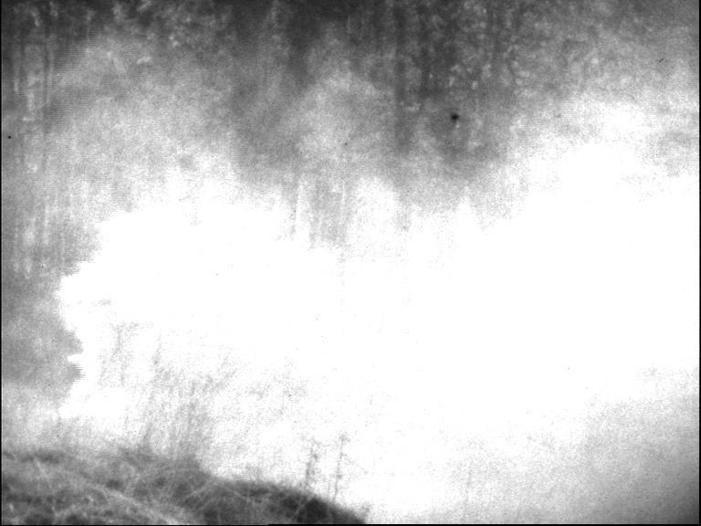 | 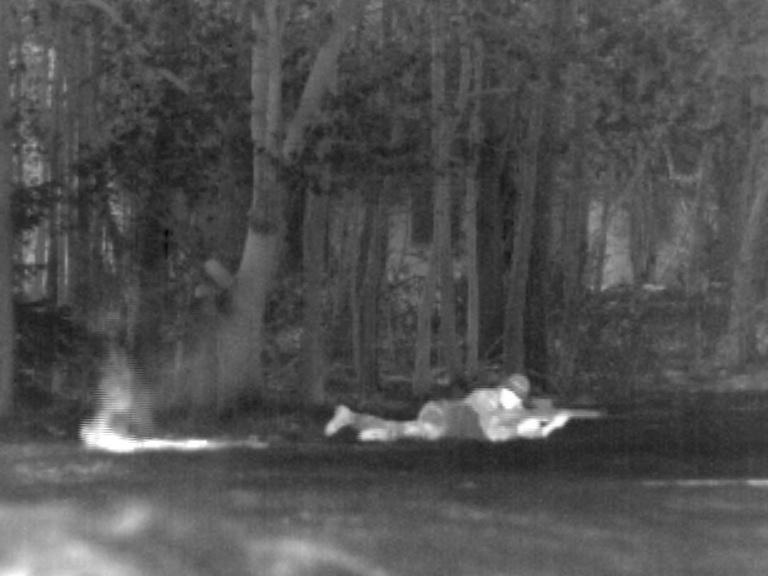 | 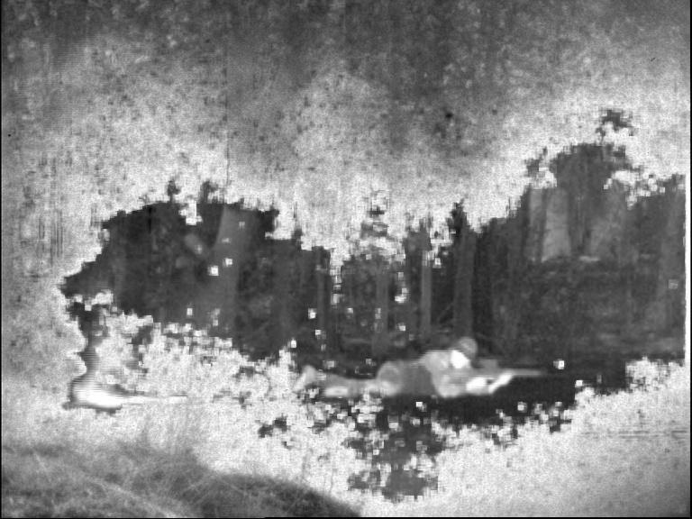 | 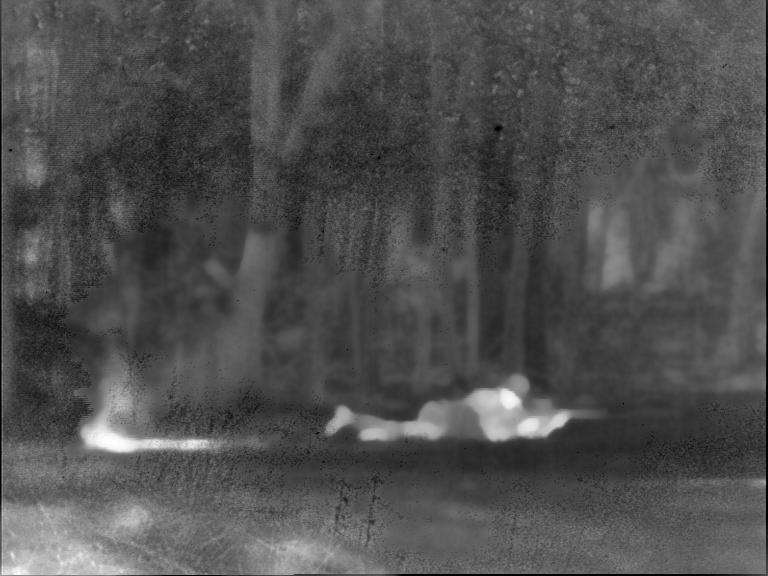 | 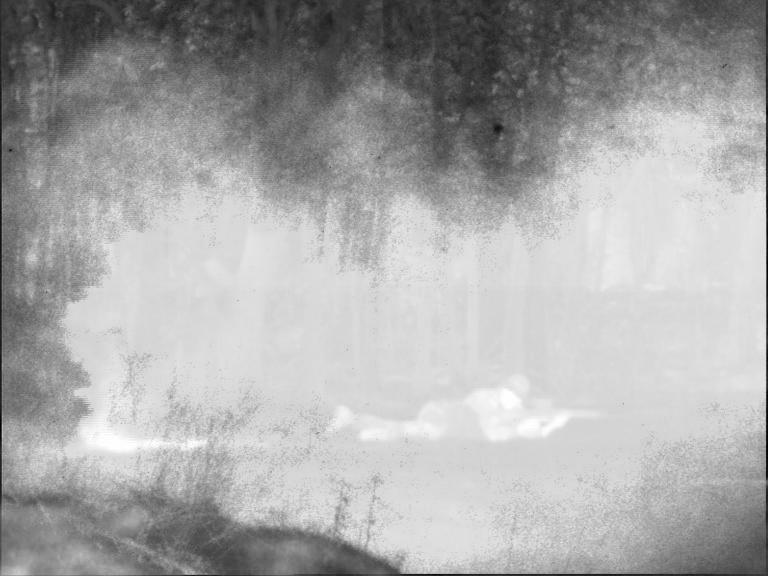 | 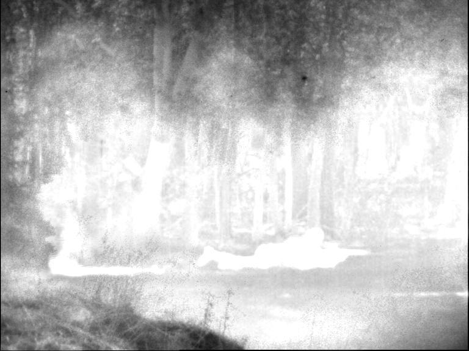 | 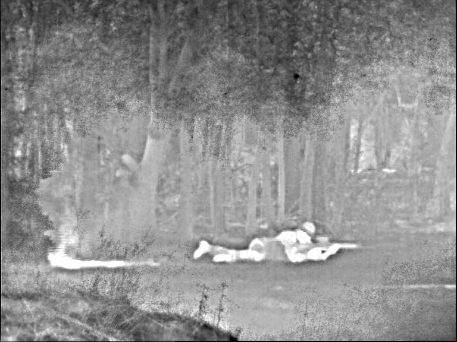 |
|                 Visible                  |                 Infrared                 |                  0.3184                  |                  0.6086                  |                    0.2135                     |                  0.1481                  |                    0.8330                     |

## Evalute

Detailed assessment information will be released in the future.

## Custom Dataset

Detailed customization information will be released in the future.

## Changelog

**2022/8/10** Public dataset address, and upload demo.

## Thanks

The dataset was carefully marked by the students of the research group of Professor Yang Shuyuan from the Key Laboratory of Intelligent Perception and Image Understanding, Ministry of Education
of the College of artificial intelligence, Xidian University.
